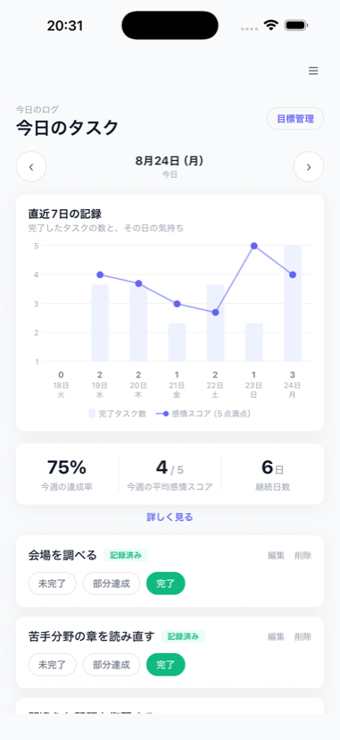
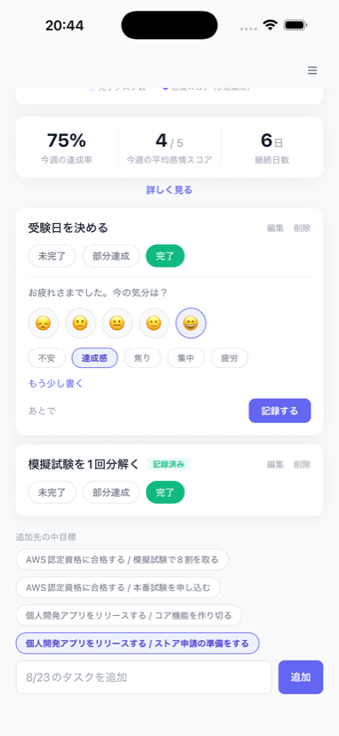
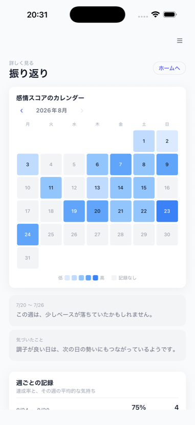
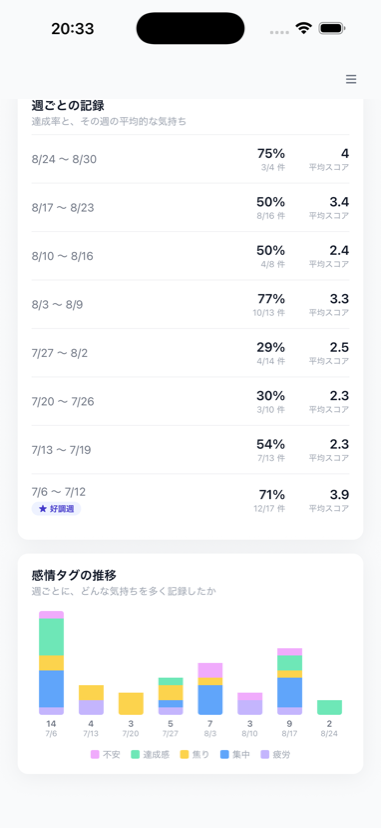
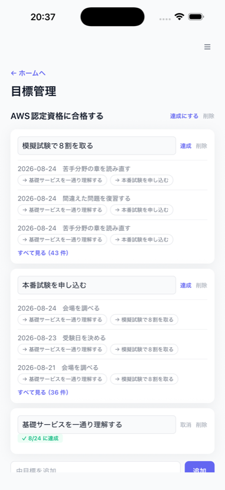

# 挽回ログ（comeback-log）

目標に向けた毎日のタスクと、そのときの気持ちを一緒に記録して、同じ時間軸で見返せるアプリです。

[](https://apps.apple.com/jp/app/id6805856355)

**App Store：** https://apps.apple.com/jp/app/id6805856355 （iOS・日本のみ配信・無料）

## 画面

| ホーム | 記録入力 | 振り返り | 週次とタグ推移 | 目標管理 |
|---|---|---|---|---|
|  |  |  |  |  |

- **ホーム**：今日のタスクと、直近7日の「完了タスク数 × 感情スコア」を重ねたグラフ
- **記録入力**：タスクを完了にしたとき、5段階のスコア → タグ → 一言の順に足せる（途中でやめてよい）
- **振り返り／週次とタグ推移**：感情スコアのカレンダー、週ごとの達成率と平均スコア、感情タグの推移
- **目標管理**：大目標 → 中目標 → 日次タスクのツリー。並行する目標を分けて管理できる

## 技術スタック

| レイヤー | 技術 |
|---|---|
| 言語 | TypeScript |
| フロントエンド | React Native (Expo) + react-native-web（Web / iOS / Android を単一コードベース） |
| バックエンド / DB | Supabase（PostgreSQL + Auth + RLS + Edge Functions） |
| グラフ描画 | ライブラリ不使用。`View` と `StyleSheet` の寸法・背景色だけで描画 |
| 集計・分析 | クライアント側のルールベース処理（統計 + 条件分岐 + 固定テンプレート文） |
| CI | GitHub Actions（Lint / 型チェック / テスト）、配信は EAS Build & Submit |

外部の AI API は使っていません。振り返りの文言は決まった計算と決まった文面で作っています。

## なぜ作ったか

浪人・再受験・キャリアの立て直しのように、長い期間を自分ひとりで管理していると、
「やったこと」の記録だけでは、なぜ進んだ週と止まった週があるのかが分かりません。
逆に気持ちだけを書き残しても、それが何と結びついていたのかは残りません。

このアプリは、その両方を同じ時間軸に並べるところまでをやります。
読み取った傾向に説明をつけるのはアプリの役割にせず、「自分はどんなときに動けて、
どんなときに止まりやすいか」に気づくのは本人に委ねる設計にしています。

そのため、気持ちの記録（スコア・タグ・自由記述）は外部サービスに送らず、
公開できるデータとはデータベース設計の段階で分離しています。広告も課金もありません。

## 開発

```bash
npm install
npm run start     # 開発サーバー
npm run web       # Web 版
npm run lint      # ESLint
npm run typecheck # tsc --noEmit
npm test          # jest-expo + React Native Testing Library
```

実行には Supabase の環境変数（`EXPO_PUBLIC_SUPABASE_URL` / `EXPO_PUBLIC_SUPABASE_ANON_KEY`）が必要です。

詳しい仕様は [`docs/要件定義書_v0.2.md`](docs/要件定義書_v0.2.md)、
ブランチ運用は [`docs/branch/ブランチ戦略.md`](docs/branch/ブランチ戦略.md) を参照してください。

## ライセンス

All Rights Reserved（[LICENSE](LICENSE)）。ソースは公開していますが、再利用・再配布は許諾していません。
